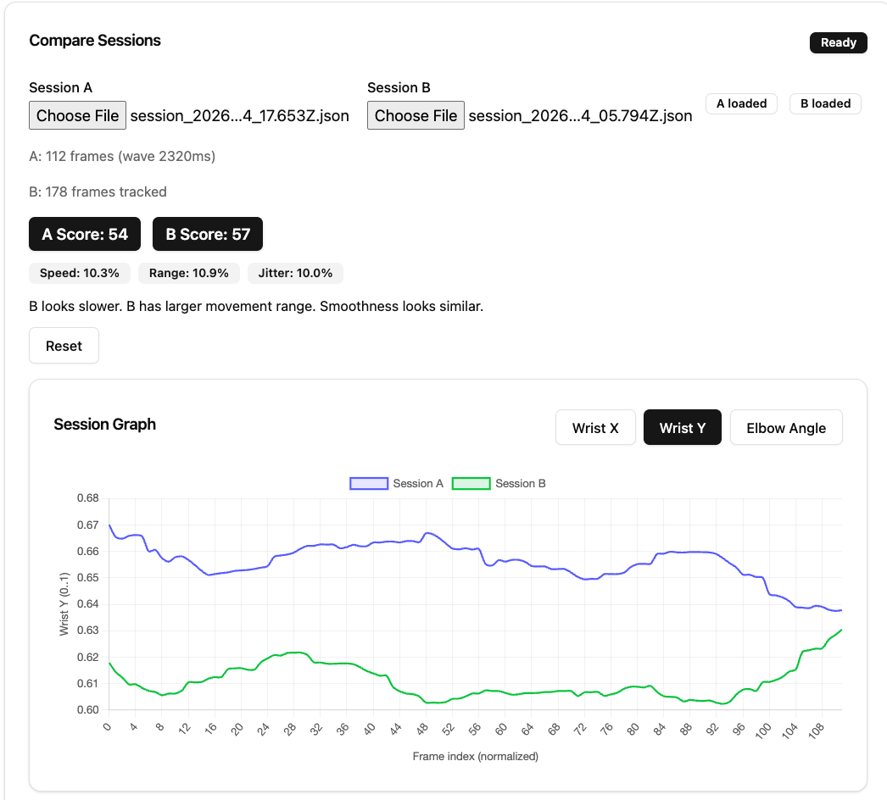
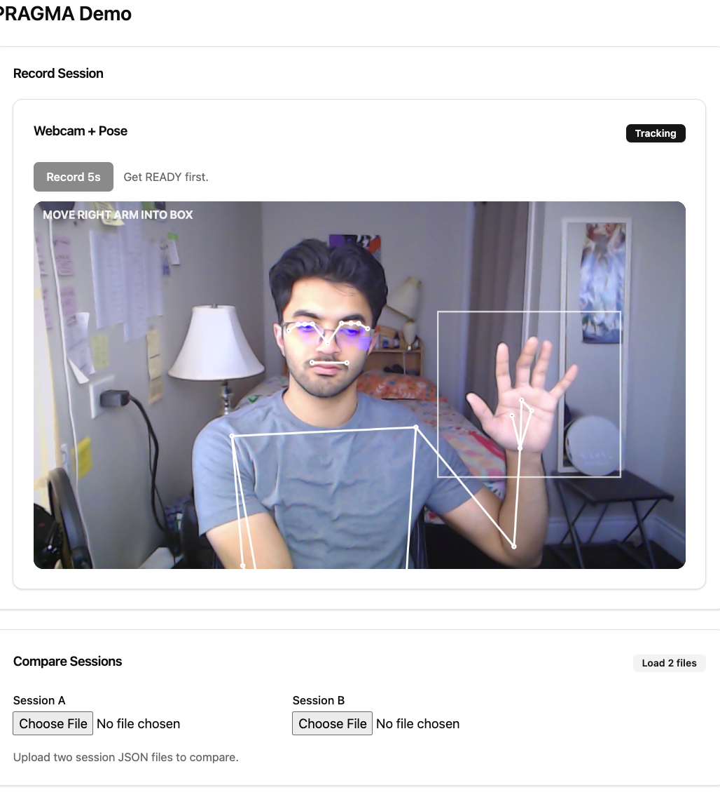

# Motion Tracking Demo

A lightweight proof-of-concept inspired by the motion analysis concepts explored by [PragmaClin](https://www.pragmaclin.com).

This web application demonstrates how real-time movement tracking and quantitative session comparison can be implemented using modern web technologies.

## Features

- Records two short movement clips  
- Extracts structured pose data (wrist position, elbow angle, timestamps)  
- Stores session data in Firebase  
- Computes movement range, average speed, smoothness, and a quality score  
- Visualizes both sessions side-by-side for comparison  

## Purpose

Built to explore real-time capture, time-series analysis, and scalable motion data processing in a clean, web-based architecture.

## Demo Images

